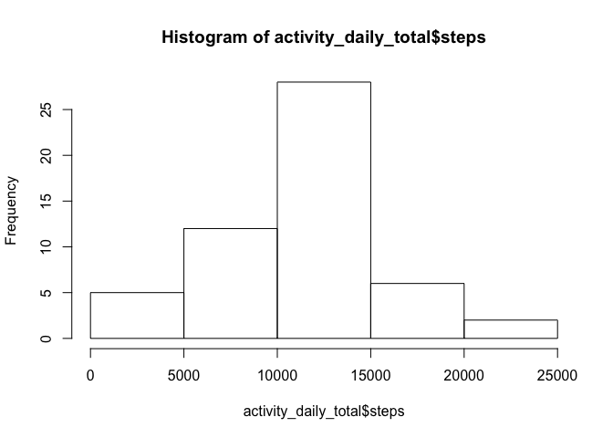

# Reproducible Research: Peer Assessment 1

## Loading and preprocessing the data
### 1. Loading in the data
  
First, in order to save processing time and unnecessary downloads, check to see
if the working data frame exists in the environment. If it does, move on.  
 

```r
if (!exists("activity")) {
        download.file(
                "https://d396qusza40orc.cloudfront.net/repdata%2Fdata%2Factivity.zip",
                destfile = "data.zip")
        unzip("data.zip", overwrite = TRUE)
        activity <- read.csv("activity.csv", na.strings = "NA")
}
```

Running `str(activity)` on the data reveals we may need to perform some
processing to make this useful:


```r
str(activity)
```

```
## 'data.frame':	17568 obs. of  3 variables:
##  $ steps   : int  NA NA NA NA NA NA NA NA NA NA ...
##  $ date    : Factor w/ 61 levels "2012-10-01","2012-10-02",..: 1 1 1 1 1 1 1 1 1 1 ...
##  $ interval: int  0 5 10 15 20 25 30 35 40 45 ...
```


### 2. Processing the data
We have already specified in the import process that values "NA" should be
imported as such when we read in the data, so no further work is needed there. 
As for dates, they can be useful as factors but they will be more useful in 
their native form. We will convert that column to dates. Finally, we see that
`interval` is represented as a column of `ints`, but since we know these are
used as identifiers to represent a 5 minute interval that repeats every day, we
should convert this to a factor. We will use the `dplyr` package.


```r
library(dplyr)
activity <- mutate(activity, 
                   date = as.Date(as.character(date)), 
                   interval = as.factor(interval))
str(activity)
```

```
## 'data.frame':	17568 obs. of  3 variables:
##  $ steps   : int  NA NA NA NA NA NA NA NA NA NA ...
##  $ date    : Date, format: "2012-10-01" "2012-10-01" ...
##  $ interval: Factor w/ 288 levels "0","5","10","15",..: 1 2 3 4 5 6 7 8 9 10 ...
```

Our `str` confirms that the data is all ready for us to start working with it!

## What is mean total number of steps taken per day?
### 1. Create a histogram for total steps each day


```r
activity_daily_total <- aggregate(steps ~ date, activity, sum)
hist(activity_daily_total$steps)
```

<!-- -->

### 2. Calculate the mean and median total number of steps per day

```r
mean(activity_daily_total$steps)
```

```
## [1] 10766.19
```

```r
median(activity_daily_total$steps)
```

```
## [1] 10765
```


## What is the average daily activity pattern?
### 1. Make a time-series plot of the average number of steps taken per interval  
  
We create a new data frame which takes the mean number of steps by interval 
across the whole dataset. It is then easy to use the base plotting package to 
put together a relatively informative plot as you can see below.  


```r
interval_mean <- aggregate(steps ~ interval, activity, mean)
with(interval_mean, 
     plot(interval, 
          steps, 
          type = "l", 
          xlab = "Interval", 
          ylab = "Mean Steps", 
          main = "Mean Steps by Interval Across All Days"))
```

<!-- -->

### 2. Which 5-minute interval on average contains the maximum number of steps?


```r
interval_mean[which.max(interval_mean$steps),]
```

```
##     interval    steps
## 104      835 206.1698
```

## Imputing missing values
### 1. Calculate and report the total number of rows with missing values in the dataset

```r
incomplete_sum          <- sum(!complete.cases(activity))
incomplete_percent      <- mean(!complete.cases(activity))
```

### 2. A strategy for filling in missing values
It seems we have a relatively small number (13.1147541%) of missing 
values, but enough that I would say it is necessary to fill in the gaps. Given 
our previous work of finding the mean value for each individual 5-minute interval
per day, we can easily extend this work to find the median value and assign all
missing step counts per five-minute interval with that median. The reason I would
not go with the mean is that it chases the tail of any skew - by picking the 
median, we may be able to counteract any skew that may be present.

## Are there differences in activity patterns between weekdays and weekends?
